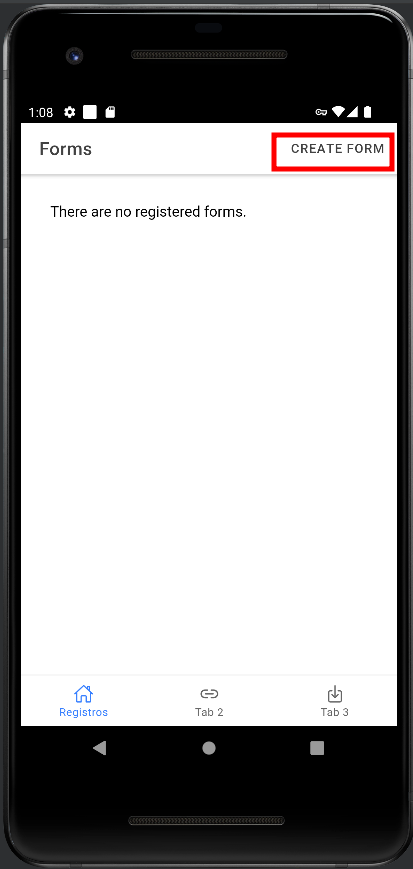
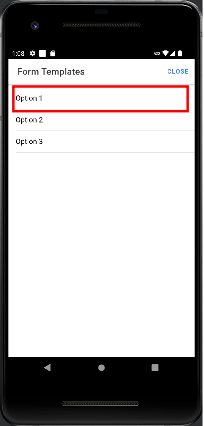
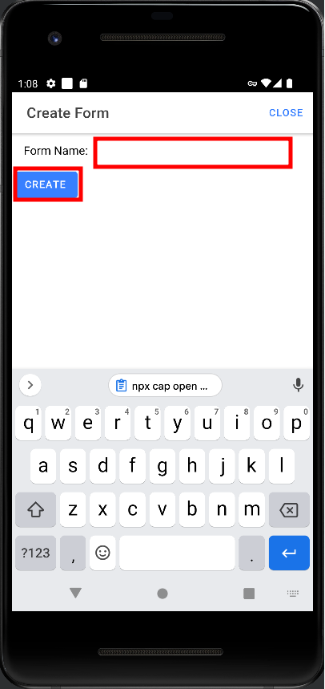
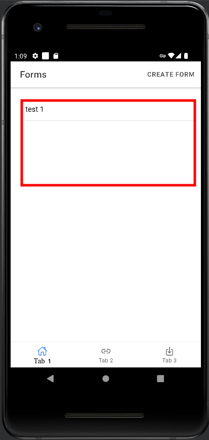

# Reproducible Example Ionic 6

## Clone the repo 

```
git clone https://github.com/Akaori/reproducible_example_ionic6.git
```


## Installation


```
npm install
sudo ionic build
sudo npx cap sync
sudo npx cap copy
sudo npx cap open android
```

## Steps to reproduce the bug:

1. Click the `CREATE FORM` button




2. Choose any option, and click it. (`Option 1`, for example)




3. Type a form name. (`test 1`, for example)




4. Click the `Create` button

5. After this, you'll be redirected to the home page, where it should contain a list of the created forms.



6. The first created form is listed correctly, but the following ones, are not listed. It's necessary to change the tab (`Tab 1 -> Tab 2 -> Tab 1`) to get the correct list of forms.


